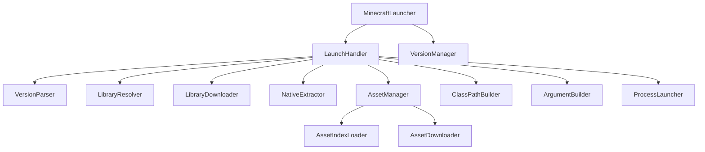

# Minecraft 启动器开发者文档

这是一个现代化的 Minecraft 启动器实现，采用模块化设计，遵循 SOLID 原则，具有良好的可扩展性和可维护性。

## 项目架构概述

启动器采用分层架构设计，各层职责明确，便于维护和扩展。

## 架构设计

### 分层架构

```
┌─────────────────────────────────────┐
│           Presentation Layer        │
│         (Program.cs 测试程序)        │
├─────────────────────────────────────┤
│           Application Layer         │
│         (MinecraftLauncher)         │
├─────────────────────────────────────┤
│            Service Layer            │
│  (各种服务类：LaunchHandler, 等)     │
├─────────────────────────────────────┤
│           Domain Layer             │
│    (模型类：Account, VersionMeta)    │
├─────────────────────────────────────┤
│          Infrastructure Layer       │
│    (工具类：HttpDownloader, 等)      │
└─────────────────────────────────────┘
```

### 核心组件关系



## 代码结构详解

### 主要命名空间

```
Kata3.Launcher.Core/
├── Models/                 # 领域模型
│   ├── Auth/              # 认证相关模型
│   │   ├── Account.cs
│   │   └── IAuthenticator.cs
│   ├── Launch/            # 启动相关模型
│   │   ├── LaunchOptions.cs
│   │   └── LaunchResult.cs
│   └── Minecraft/         # Minecraft 数据模型
│       ├── Arguments.cs
│       ├── AssetIndex.cs
│       ├── Library.cs
│       ├── Rule.cs
│       └── VersionMeta.cs
├── Services/              # 业务服务
│   ├── Asset/            # 资源管理服务
│   ├── Auth/             # 认证服务
│   ├── Launch/           # 启动服务
│   ├── Library/          # 库管理服务
│   └── Version/          # 版本管理服务
└── Utilities/            # 工具类
    ├── FileHelper.cs
    ├── HttpDownloader.cs
    ├── JsonHelper.cs
    ├── MinecraftUtils.cs
    ├── OsHelper.cs
    └── PathHelper.cs
```

## 核心设计模式

### 1. 依赖注入模式

通过构造函数注入依赖，提高可测试性：

```csharp
public class LaunchHandler
{
    private readonly VersionParser _versionParser;
    private readonly LibraryResolver _libraryResolver;
    // ... 其他依赖

    public LaunchHandler(
        VersionParser versionParser,
        LibraryResolver libraryResolver,
        // ... 其他参数
    )
    {
        _versionParser = versionParser;
        _libraryResolver = libraryResolver;
        // ... 初始化其他依赖
    }
}
```

### 2. 策略模式

不同的认证策略实现：

```csharp
public interface IAuthenticator
{
    Task<Account> AuthenticateAsync(string username, string password);
}

public class OfflineAuthenticator : IAuthenticator
{
    public Task<Account> AuthenticateAsync(string username, string password)
    {
        // 离线认证实现
    }
}
```

### 3. 观察者模式

进度通知机制：

```csharp
public interface IProgress<T>
{
    void Report(T value);
}

// 使用示例
var progress = new Progress<AssetDownloadProgress>(p => {
    Console.WriteLine($"下载进度: {p.Percentage}%");
});
```

## 关键算法解析

### 1. 类路径构建算法

```csharp
public string Build(string minecraftRoot, Models.Minecraft.VersionMeta version)
{
    var paths = new List<string>();

    // 添加适用的库文件
    foreach (var lib in version.Libraries)
    {
        if (!IsLibraryApplicable(lib))
            continue;

        if (lib.Downloads?.Artifact != null)
        {
            string path = Path.Combine(minecraftRoot, "libraries", lib.Downloads.Artifact.Path);
            paths.Add(path);
        }
    }

    // 添加客户端 JAR
    string versionJar = Path.Combine(minecraftRoot, "versions", version.Id, $"{version.Id}.jar");
    if (File.Exists(versionJar))
    {
        paths.Add(versionJar);
    }

    return string.Join(Path.PathSeparator, paths);
}
```

### 2. 参数构建算法

```csharp
private void ProcessGameArguments(
    List<string> game, 
    Models.Minecraft.VersionMeta version, 
    LaunchOptions options, 
    string nativesDir)
{
    if (version.Arguments?.Game != null)
    {
        foreach (var obj in version.Arguments.Game)
        {
            if (obj is System.Text.Json.JsonElement jsonElement)
            {
                if (jsonElement.ValueKind == System.Text.Json.JsonValueKind.String)
                {
                    string strValue = jsonElement.GetString() ?? "";
                    string replaced = ReplacePlaceholders(strValue, options, version, nativesDir);
                    game.Add(replaced);
                }
            }
        }
    }
}
```

## 并发处理

### 资源下载并发控制

```csharp
public async Task DownloadMissingAssetsAsync(
    string minecraftRoot, 
    AssetIndex assetIndex, 
    IProgress<AssetDownloadProgress>? progress = null)
{
    var toDownload = new ConcurrentBag<KeyValuePair<string, AssetObject>>();
    
    // 收集需要下载的资源
    foreach (var kv in assetIndex.Objects)
    {
        // 检查文件是否存在且完整
        if (!File.Exists(assetPath) || new FileInfo(assetPath).Length != kv.Value.Size)
        {
            toDownload.Add(kv);
        }
    }

    int total = toDownload.Count;
    int completed = 0;
    var options = new ParallelOptions { MaxDegreeOfParallelism = _maxConcurrency };

    // 并发下载
    await Parallel.ForEachAsync(toDownload, options, async (kv, token) =>
    {
        try
        {
            await _httpDownloader.DownloadFileAsync(url, destPath, hash, token);
            int current = Interlocked.Increment(ref completed);
            progress?.Report(new AssetDownloadProgress { Completed = current, Total = total });
        }
        catch (Exception ex)
        {
            // 记录错误但继续处理其他文件
            Console.WriteLine($"警告: 下载资源 {kv.Key} 失败: {ex.Message}");
        }
    });
}
```

## 错误处理机制

### 分层错误处理

```csharp
public async Task<LaunchResult> LaunchAsync(LaunchOptions options, IProgress<AssetDownloadProgress>? assetProgress = null)
{
    try
    {
        // 确保游戏版本完整性
        await _versionManager.EnsureVersionIntegrityAsync(options.MinecraftRoot, options.VersionId);
        
        // 执行启动流程
        return await _launchHandler.LaunchAsync(options, assetProgress);
    }
    catch (FileNotFoundException ex)
    {
        return new LaunchResult { Success = false, Error = $"缺少必要文件: {ex.Message}" };
    }
    catch (UnauthorizedAccessException ex)
    {
        return new LaunchResult { Success = false, Error = $"权限不足: {ex.Message}" };
    }
    catch (Exception ex)
    {
        return new LaunchResult { Success = false, Error = $"启动失败: {ex.Message}" };
    }
}
```

## 性能优化策略

### 1. 内存优化

```csharp
// 使用流式处理避免大文件加载到内存
await using var contentStream = await response.Content.ReadAsStreamAsync();
await using var fileStream = new FileStream(versionJarPath, FileMode.Create, FileAccess.Write, FileShare.None);
await contentStream.CopyToAsync(fileStream);
```

### 2. 网络优化

```csharp
// HTTP 下载器的优化实现
public async Task DownloadFileAsync(
    string url, 
    string destinationPath, 
    string? expectedHash = null,
    CancellationToken cancellationToken = default)
{
    using var response = await _httpClient.GetAsync(url, HttpCompletionOption.ResponseHeadersRead, cancellationToken);
    response.EnsureSuccessStatusCode();
    
    // 流式下载，减少内存占用
    await using var contentStream = await response.Content.ReadAsStreamAsync(cancellationToken);
    await using var fileStream = new FileStream(destinationPath, FileMode.Create, FileAccess.Write, FileShare.None);
    await contentStream.CopyToAsync(fileStream, cancellationToken);
    
    // 可选的 SHA1 校验
    if (!string.IsNullOrEmpty(expectedHash))
    {
        await ValidateFileHash(destinationPath, expectedHash);
    }
}
```

### 3. 缓存机制

```csharp
// 版本解析缓存
private readonly ConcurrentDictionary<string, VersionMeta> _versionCache = new();

public async Task<VersionMeta> ParseAsync(string versionJsonPath)
{
    if (_versionCache.TryGetValue(versionJsonPath, out var cached))
    {
        return cached;
    }

    var version = await ParseFromFileAsync(versionJsonPath);
    _versionCache.TryAdd(versionJsonPath, version);
    return version;
}
```

## 测试策略

### 单元测试示例

```csharp
[TestFixture]
public class VersionManagerTests
{
    private VersionManager _versionManager;
    private Mock<HttpDownloader> _mockHttpDownloader;
    private Mock<VersionParser> _mockVersionParser;

    [SetUp]
    public void Setup()
    {
        _mockHttpDownloader = new Mock<HttpDownloader>();
        _mockVersionParser = new Mock<VersionParser>();
        _versionManager = new VersionManager(_mockHttpDownloader.Object, _mockVersionParser.Object);
    }

    [Test]
    public async Task EnsureVersionIntegrityAsync_ShouldDownloadMissingFiles()
    {
        // Arrange
        var minecraftRoot = Path.GetTempPath();
        var versionId = "1.19.2";
        
        // Act
        var result = await _versionManager.EnsureVersionIntegrityAsync(minecraftRoot, versionId);
        
        // Assert
        Assert.IsNotNull(result);
        _mockHttpDownloader.Verify(x => x.DownloadFileAsync(It.IsAny<string>(), It.IsAny<string>(), It.IsAny<string>()), Times.AtLeastOnce());
    }
}
```

## 扩展性设计

### 插件架构

```csharp
// 可扩展的认证接口
public interface IAuthenticator
{
    string ProviderName { get; }
    Task<Account> AuthenticateAsync(AuthenticationRequest request);
}

// 第三方认证插件示例
public class MicrosoftAuthenticator : IAuthenticator
{
    public string ProviderName => "Microsoft";
    
    public async Task<Account> AuthenticateAsync(AuthenticationRequest request)
    {
        // Microsoft 认证实现
    }
}
```

### 配置驱动

```csharp
// 可配置的服务注册
public class ServiceConfiguration
{
    public int MaxDownloadConcurrency { get; set; } = 8;
    public TimeSpan DownloadTimeout { get; set; } = TimeSpan.FromMinutes(30);
    public bool EnableCompression { get; set; } = true;
}

// 使用配置
var config = new ServiceConfiguration
{
    MaxDownloadConcurrency = 16,
    DownloadTimeout = TimeSpan.FromMinutes(60)
};
```

## 部署和发布

### 构建配置

```xml
<!-- Kata3.csproj -->
<Project Sdk="Microsoft.NET.Sdk">
  <PropertyGroup>
    <TargetFramework>net10.0</TargetFramework>
    <Nullable>enable</Nullable>
    <ImplicitUsings>enable</ImplicitUsings>
    <AssemblyVersion>1.0.0</AssemblyVersion>
    <FileVersion>1.0.0</FileVersion>
  </PropertyGroup>
  
  <ItemGroup>
    <PackageReference Include="System.Text.Json" Version="8.0.0" />
  </ItemGroup>
</Project>
```

### 发布命令

```bash
# 发布为自包含应用
dotnet publish -c Release -r win-x64 --self-contained true

# 发布为框架依赖应用
dotnet publish -c Release -r win-x64 --self-contained false

# 生成单文件可执行程序
dotnet publish -c Release -r win-x64 -p:PublishSingleFile=true
```

## 监控和日志

### 结构化日志

```csharp
public class LaunchLogger
{
    private readonly ILogger _logger;
    
    public void LogLaunchStart(LaunchOptions options)
    {
        _logger.LogInformation("开始启动 Minecraft {VersionId}", options.VersionId);
        _logger.LogDebug("启动配置: {@Options}", options);
    }
    
    public void LogLaunchError(Exception ex, LaunchOptions options)
    {
        _logger.LogError(ex, "启动 Minecraft {VersionId} 失败", options.VersionId);
    }
}
```

## 安全考虑

### 1. 输入验证

```csharp
public class LaunchOptionsValidator
{
    public ValidationResult Validate(LaunchOptions options)
    {
        var errors = new List<string>();
        
        if (string.IsNullOrWhiteSpace(options.JavaPath))
            errors.Add("Java 路径不能为空");
            
        if (!File.Exists(options.JavaPath))
            errors.Add("指定的 Java 路径不存在");
            
        if (options.MaxMemory < 512)
            errors.Add("最大内存不能小于 512MB");
            
        return new ValidationResult(errors.Count == 0, errors);
    }
}
```

### 2. 路径安全

```csharp
public static class PathSecurity
{
    public static string SanitizePath(string path)
    {
        // 移除危险字符
        var invalidChars = Path.GetInvalidPathChars();
        foreach (var invalidChar in invalidChars)
        {
            path = path.Replace(invalidChar.ToString(), "");
        }
        
        // 防止路径遍历攻击
        path = Path.GetFullPath(path);
        return path;
    }
}
```

## 贡献指南

### 代码规范

1. 遵循 .NET 编码约定
2. 使用 nullable 引用类型
3. 添加适当的 XML 注释
4. 编写单元测试覆盖新功能

### 提交规范

```bash
# 功能提交
git commit -m "feat: 添加新的认证提供者"

# 修复提交
git commit -m "fix: 修复资源下载并发问题"

# 文档提交
git commit -m "docs: 更新 API 文档"
```

---

::: info
**开发者文档版本：** 1.0  
**最后更新：** 2026年2月
:::

::: tip 提示
如需了解具体的 API 使用方法，请查看 [API 参考文档](../api/api-documentation)。
:::